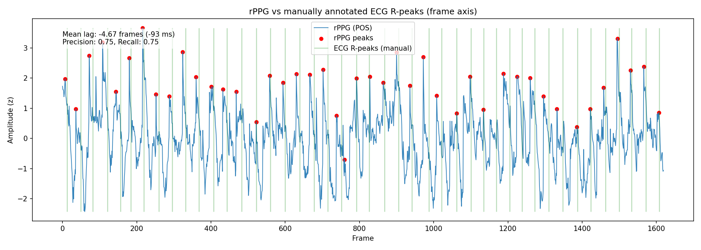

# rPPG MVP — Research Prototype

This repository contains a **research-oriented MVP** exploring remote photoplethysmography (rPPG) for heart rate estimation from video.

The focus is on:

- classical rPPG methods (Green channel, POS)

- BPM estimation from peak intervals

- validation against simultaneously recorded ECG

⚠️ This is not production code.  

The goal is to demonstrate research reasoning, signal processing, and validation methodology.

## Documentation

- Detailed research notes (in Russian): [docs/research_ru.md](docs/research_ru.md)

## Collaboration

This work was developed in close collaboration with an AI assistant (ChatGPT), treated as a research partner, while all technical decisions and interpretations were made by the author.

