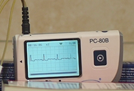
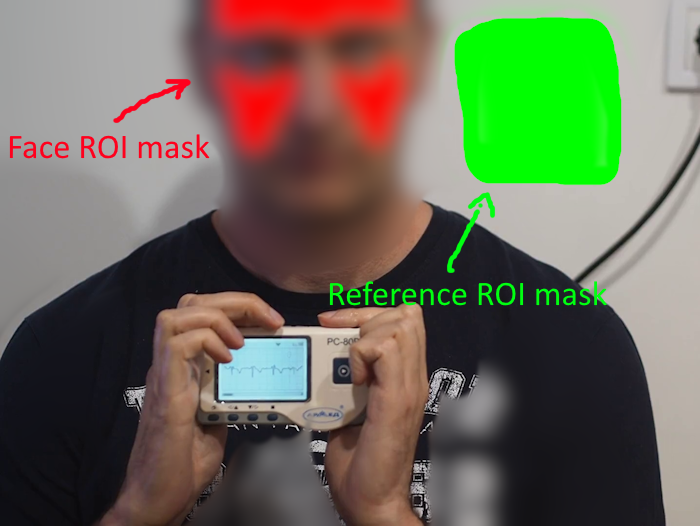
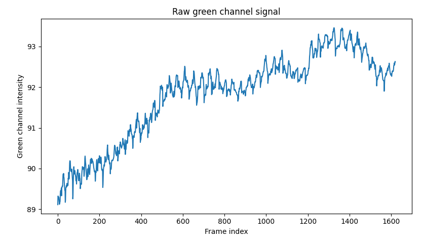
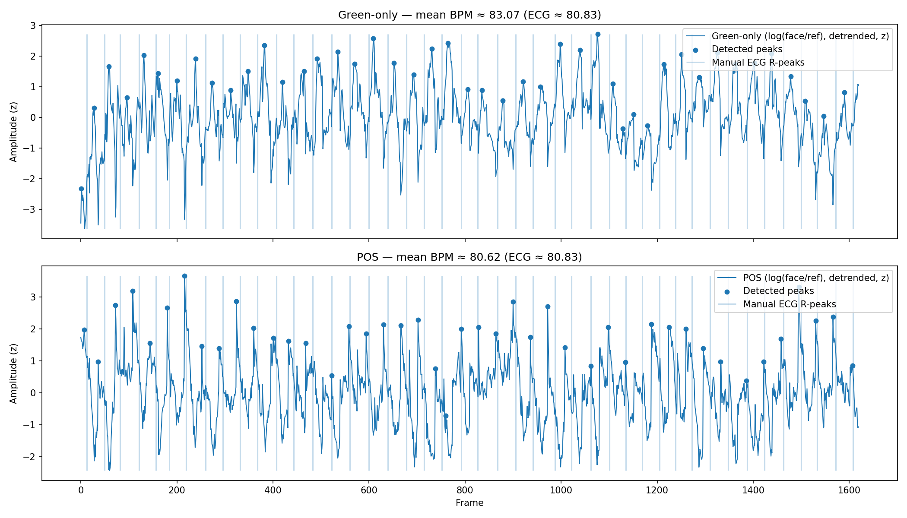
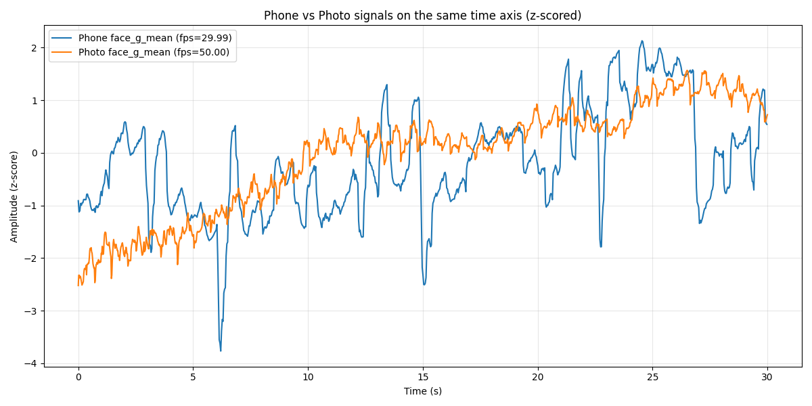
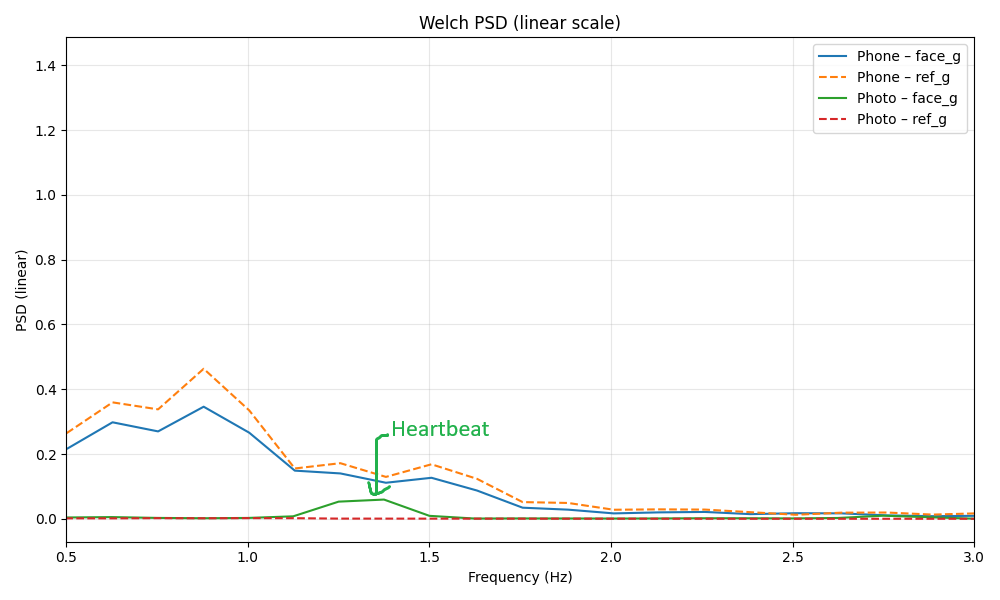

# Исследование измерения частоты сердечных сокращений по видеозаписи с валидацией по ЭКГ

## Введение

В данной работе исследовалась возможность оценки частоты сердечных сокращений (ЧСС) по видеоизображению лица с использованием методов дистанционной фотоплетизмографии (rPPG).

Видеозапись выполнялась фотокамерой **Olympus OM-D E-M10 Mark III**, а валидация результатов осуществлялась на основе синхронной записи электрокардиограммы (ЭКГ), полученной с помощью портативного одноканального кардиографа **PC-80B**.

Целью исследования являлась демонстрация применимости классических rPPG-подходов и корректной методологии их валидации, а не создание готового программного решения.

Основной код рассчётов **05_green_vs_pos_analys.py** и **06_deep_analys.py**

## Постановка задачи

Методы rPPG основаны на анализе микроскопических изменений цветовых компонент кожи, обусловленных периодическими изменениями кровенаполнения поверхностных сосудов. На практике применение rPPG осложняется низким отношением сигнал/шум, зависимостью от условий освещения и неоднозначностью алгоритмов обработки и агрегации ЧСС.

В рамках работы рассматривались:

* извлечение rPPG-сигнала из видеопоследовательности;
* оценка ЧСС по временным интервалам между пиками;
* сравнение полученных оценок с эталонной ЭКГ.

## Последовательность действий
* Отснять видео и обрезать его в редакторе так, чтобы его начало совпадало с началом регистрации ЭКГ, а завершеное совпадало с завершением регистрации ЭКГ. Во время съемки голова по возможности не должна смещаться
* Получить кадр из видео при помощи скрипта **01_get__one_frame.py**. Он будет сохранён в файл **one_frame.png**
* На этом кадре определить прямоугольник, в котором находится шкала ЭКГ, модифицировать скрипт **02_extract_ecg_frames.py**, указав в нём ROI для дисплея кардиографа и при помощи этого скрипта извлечь из видео фреймы, на которых виден только кардиограф
* Разметить кадры, где формируется зубец R при помощи утилиты **03_ecg_marker.py**. Данные будут автоматически сохранены в mark.csv
* Создать маску для лица и референса. Для этого нарисовать на кадре, полученном на втором шаге цветом R=255,G=0,B=0 маску лица, а цветом R=0,G=255,B=0 маску референса (серую стену или белую бумагу). Сохранить файл и назвать его **face_mask_proc.png**
* Запустить утилиту **04_data_extractor.py**, которая пройдёт по всем кадрам видео и произведёт измерение средних значений в каждом канале под масками. Результаты будут находиться в файле **signals.csv**
* Запустить анализ сравнения методов POS и прямого анализа зелёного канала при помощи утилиты **05_green_vs_pos_analys.py** Она посчитает ЧСС при помощи POS, анализа зелёного канала и на основе меток ЭКГ и сохранит график сопоставления
* Запустить более глубокий анализ при помощи утилиты **06_deep_analys.py**. Она посчитает метрики сопоставления, нарисует график и добавит ещё несколько файлов с рассчитанными значениями пиков.

## Получение данных

Анализ rPPG выполнялся на выбранной области лица без компенсации движений. Из видеопоследовательности формировались временные ряды цветовых каналов.

Поскольку лицо было статичным на протяжении всего видео, то использовалась заранее подготовленная маска для ROI лица. Средние показатели считались по пикселам под этой маской (красный цвет).

ЭКГ использовалась для детекции R-пиков, вычисления RR-интервалов и расчёта эталонной ЧСС. Синхронизация видео и ЭКГ выполнялась по времени начала записи.
Из видео вырезались ROI для электрокардиографа и затем пики (соответствующие зубцу R на кардиографе) размечались вручную при помощи утилиты **03_ecg_marker.py**.
Результаты разметки автоматически сохранялись в файл **mark.csv**.

Полученный сигнал в зелёном канале выглядит следующим образом:

## Используемые методы

В исследовании были реализованы и сравнены два подхода:

метод зелёного канала, основанный на анализе средней интенсивности зелёного цветового канала;

POS-метод, использующий проекцию цветовых каналов для подавления влияния освещения.

POS-метод продемонстрировал более стабильный сигнал по сравнению с использованием одного цветового канала.

## Расчёт ЧСС и валидация

ЧСС оценивалась на основе детекции пиков rPPG-сигнала и вычисления RR-интервалов. Было показано, что усреднение мгновенных значений BPM и вычисление BPM по среднему RR-интервалу приводят к различным результатам и могут формировать систематическое смещение оценки.

Валидация выполнялась путём сравнения rPPG-оценок ЧСС с эталонными значениями, полученными по ЭКГ. Результаты показали, что:

метод зелёного канала склонен к завышению ЧСС;

POS-метод демонстрирует более близкое соответствие ЭКГ;

способ агрегации интервалов существенно влияет на итоговую оценку ЧСС.

## Сопоставление пиков

Для каждого R-пика ЭКГ осуществлялся поиск соответствующего пика rPPG в фиксированном временном окне ±250 мс относительно времени R-пика.

Если в данном окне обнаруживался rPPG-пик, он считался корректно сопоставленным. В противном случае данный сердечный цикл рассматривался как пропущенный или некорректно детектированный rPPG.

Выбор окна ±250 мс обусловлен следующими соображениями:

rPPG-сигнал физиологически запаздывает относительно электрической активности сердца;

возможны дополнительные фазовые сдвиги, связанные с фильтрацией сигнала;

при частоте сердечных сокращений порядка 60–120 уд/мин данное окно существенно меньше длительности одного кардиоцикла и не приводит к неоднозначному сопоставлению.

## Оценка precision и recall

Для оценки качества детекции rPPG-пиков использовались метрики precision и recall, вычисляемые на основе сопоставления rPPG-пиков с R-пиками ЭКГ.

Каждый R-пик ЭКГ рассматривался как эталонное событие. rPPG-пик считался корректно детектированным, если он находился в пределах фиксированного временного окна ±250 мс относительно соответствующего R-пика ЭКГ.

* **Precision**  характеризует долю rPPG-пиков, которые были корректно сопоставлены с пиками ЭКГ.

* **Recall** характеризует долю R-пиков ЭКГ, для которых был найден соответствующий rPPG-пик.

Таким образом, precision отражает количество ложных срабатываний rPPG, а recall — количество пропущенных сердечных циклов относительно ЭКГ.

## Результаты оценки

* Precision: 0.75
* Recall: 0.75
* Средняя задержка: 4.6 кадров
* Средняя задержка: 93.3 мс
* Отклонение средней задержки 88.0 mc
* Средний пульс (ЭКГ) = 80.83 bpm
* Коэффициент вариабильности ритма (ЭКГ) = 0.083
* Средний пульс (rPPG, Green) = 83.07 bpm (завышен!)
* Средний пульс (rPPG, POS) = 80.62 bpm
* Коэффициент вариабильности ритма (rPPG, POS) = 0.164

## Сравнение телефона и фотоаппарата
Параллельно была проведена оценка возможности извлечения пульсового сигнала из видеозаписей, полученных с фронтальной камеры смартфона и с фотокамеры. 

Для обоих источников анализировались временные сигналы и их спектральные представления. Показано, что в данных фотокамеры в физиологически значимом диапазоне частот формируется выраженный спектральный пик, соответствующий сердечному ритму, тогда как в сигнале со смартфона данный пик отсутствует.

* face_g - это сигнал зелёного канала от лица
* ref_g - это сигнал зелёного канала от стены (референсный сигнал)

## Ограничения и выводы

Исследование носит характер MVP и proof-of-concept и выполнено в фиксированных условиях без компенсации движений и применения методов машинного обучения.

Тем не менее, работа демонстрирует принципиальную возможность оценки ЧСС по видеозаписи и подчёркивает необходимость аккуратной интерпретации метрик и обязательной валидации rPPG-результатов по эталонным физиологическим сигналам.

